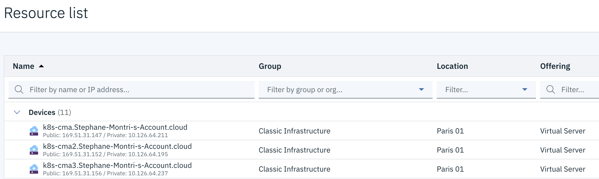
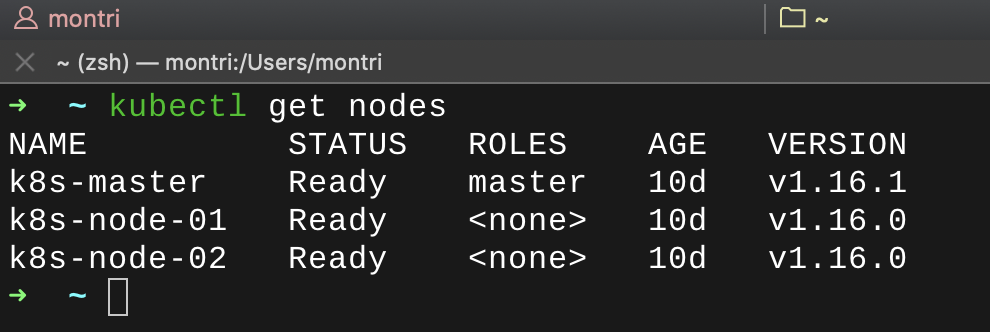

# Lab 0: Environment

## Infrastructure

All infrastructure has been deployed on IBM Cloud



## Connect to the K8s Master

We use ssh to connect to the master.

```console
ssh k8s-userXX@169.51.31.147
```

Please use the credentials from the user which has been assigned to you.

## Check that cluster is ready

In order to check that the cluster is running, use following command:

```shell
kubectl get nodes
```

Output should look like this

