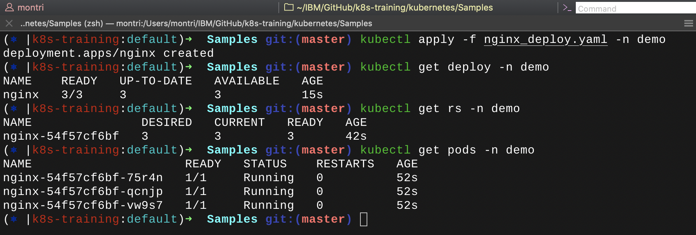
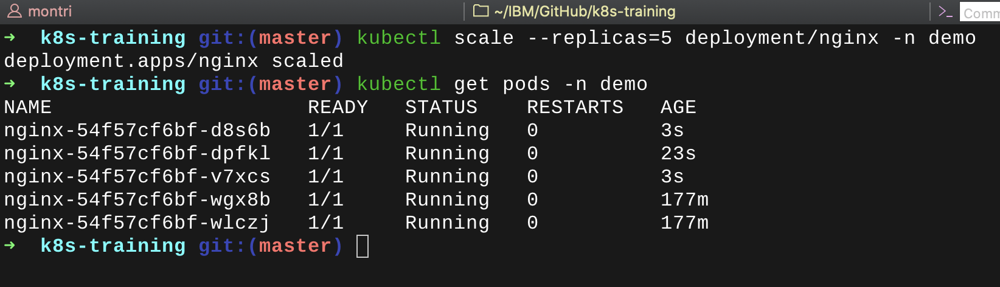
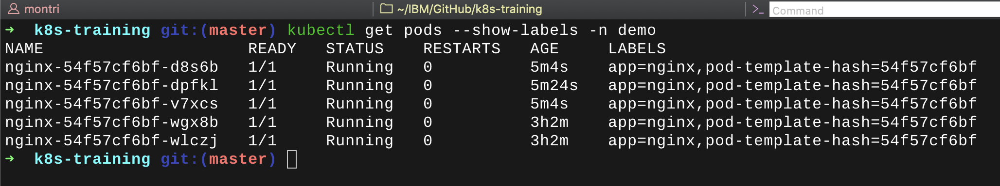
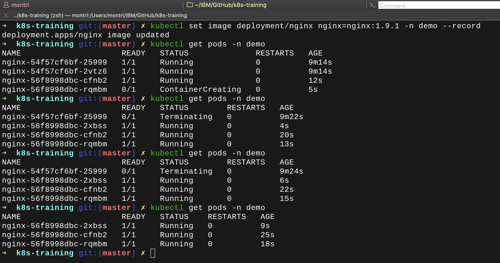
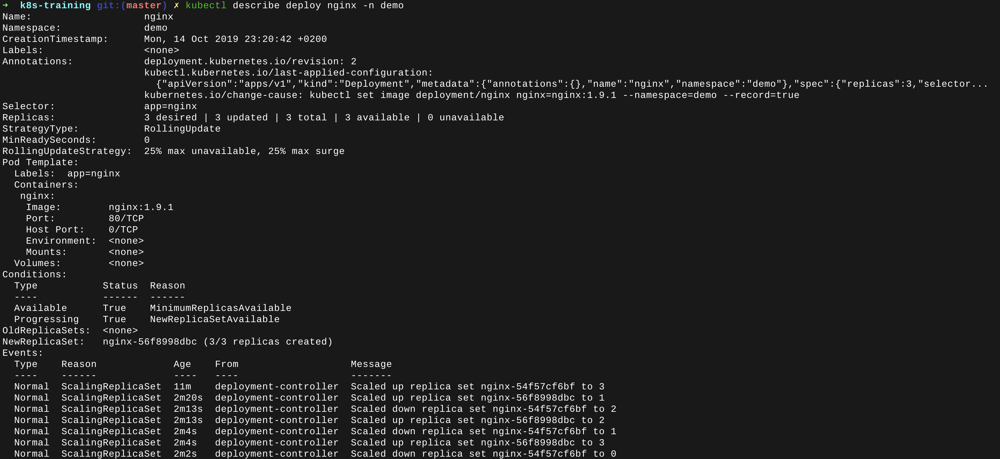
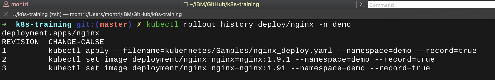
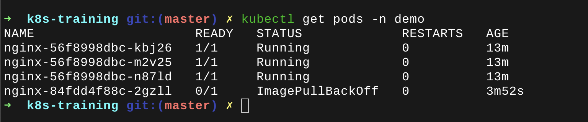
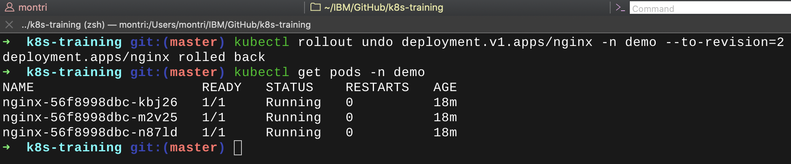

# Lab 1: Application deployment

## Connect to the K8s cluster

Use Lab 0 information and credentials to connect to 

## Create a deployment

We will deploy a NGINX application using a Kubernetes Deployment.
Create the YAML file `nginx_deploy.yaml` in your home directory with below content:

```yaml
apiVersion: apps/v1
kind: Deployment
metadata:
  name: nginx
  labels:
    app: nginx
spec:
  replicas: 3
  selector:
    matchLabels:
      app: nginx
  template:
    metadata:
      labels:
        app: nginx
    spec:
      containers:
      - name: nginx
        image: nginx:1.7.9
        ports:
        - containerPort: 80
```

To deploy the application, use the following command:

```shell
kubectl apply -f nginx_deploy.yaml -n <your-namespace> --record # -- record allow history of deployment updates
```
Following objects are created:


### Deployment:

```shell
kubectl get deploy -n <your-namespace>
```

### ReplicaSet:

```shell
kubectl get rs -n <your-namespace>
```

### Pods:
```shell
kubectl get pods -n <your-namespace>
```


## Expose application

To expose the application, we will create a service.
For this example, we will use ClusterIP/NodePort option. This will allow to call the service from any Node using the NodePort that has been assigned to the service.

Create the YAML file `nginx_service.yaml` in your home directory with below content:

```yaml
apiVersion: v1
kind: Service
metadata:
  name: nginx-nodeport
spec:
  type: NodePort
  selector:
    app: nginx
  ports:
    - protocol: TCP
      port: 80
      targetPort: 8080
      #nodePort: 30080
```

To expose the application, use the following command:

```shell
kubectl apply -f nginx_service.yaml -n <your-namespace>
```

## Scale application

We will now scale the application in order to have 5 replicas for the nginx deployment.

```shell
kubectl scale --replicas=5 deployment/nginx -n <your-namespace>
```

Have a look at the number of pods afterwards:



Additionally, you can show labels applied on Pods:

```shell
kubectl get pods --show-labels -n <your-namespace>
```


## Rollout & Rollback deployment

We will now update the deployment to change the Docker image used (from nginx:1.7.9 to nginx:1.9.1)

```shell
kubectl set image deployment/nginx nginx=nginx:1.9.1 -n <your-namespace> --record
```



Let's see the updated deployment in details

```shell
kubectl describe deploy/nginx -n demo
```


We see that image has been updated!

Run the following command to update the deployment one more time:

```shell
kubectl set image deployment/nginx nginx=nginx:1.91 -n <your-namespace> --record
```

Now, we check the history of rollouts:

```shell
kubectl rollout history deployment/nginx -n <your-namespace>
```


Unfortunately we made a mistake with the image name... nginx:1.91 instead of nginx:1.9.1



We will then perform a rollback to revision 2:

```shell
kubectl rollout undo deployment.v1.apps/nginx -n <your-namespace> --to-revision=2
```


THIS ENDS LAB #1!